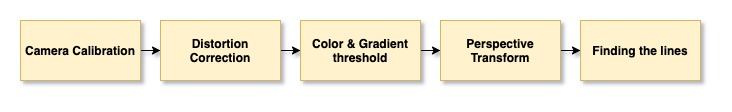

## Advanced Lane Finding
The project goal is to build a software pipeline by computer vision to identify the lane boundaries in a video from a front-facing camera on a car.



### Table of Contents

1. [Project Motivation](#motivation)
2. [File Descriptions](#files)
3. [Run](#results)
4. [Licensing, Authors, and Acknowledgements](#licensing)

## Project Motivation<a name="motivation"></a>
Analyzing pixels of every video frame identify lane lines using the OpenCV library of computer vision.

[](http://www.udacity.com/drive)


## File Descriptions <a name="files"></a>

```
- advanced_lane_finding.ipynb   # Research file
- main.py         # The main file of the pipeline
- camera_cal      # Camera calibration images
- output_result   # Output result images and video
- pickle     # Save the Camera calibration matrix
- requirements.txt # Dependent installation package
- test_images # images for testing the pipline
- test_video  # video for testing the pipline
- writeup.md  # the project report
- README.md   # the project readme
```

## Run <a name="results"></a>

```
pip install -r requirments.txt
```
```
jupyter notebook
```
or 
```
python main.py
```

## Licensing, Authors, and Acknowledgements <a name="licensing"></a>

### Built With
* [OpenCV](https://opencv.org/) - OpenCV is a highly optimized library with focus on Computer vision.

* [MoviePy](https://zulko.github.io/moviepy/) - MoviePy is a Python module for video editing.

### Versioning

* We use [SemVer](http://semver.org/) for versioning. For the versions available, see the [tags on this repository](https://github.com/your/project/tags).

### Authors

* **Tom Ge** - *Self-Driving Car Engineer* - [github profile](https://github.com/tomgtqq)

### License

* This project is licensed under the MIT License
