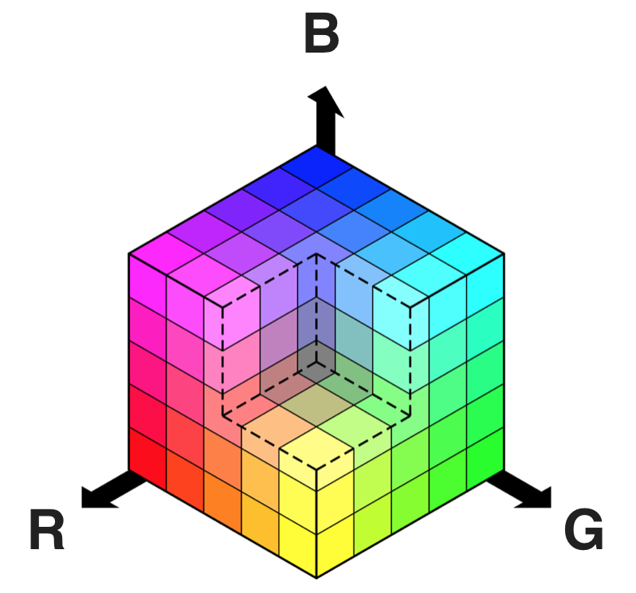
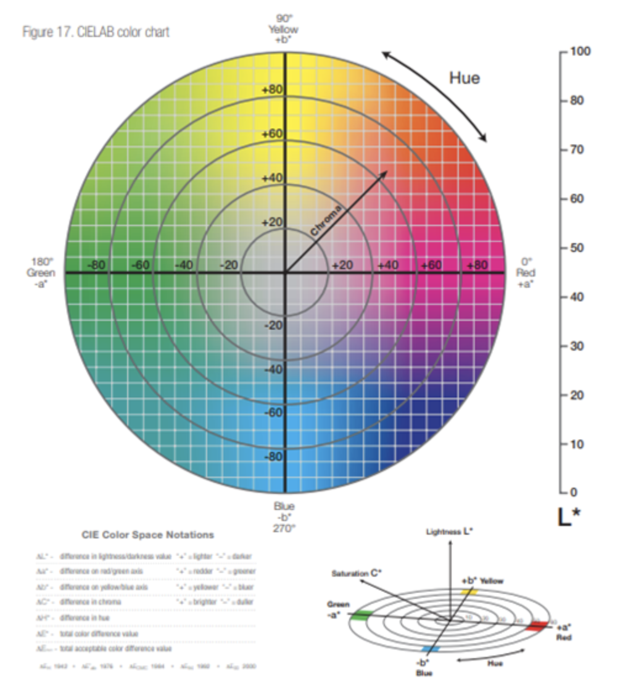
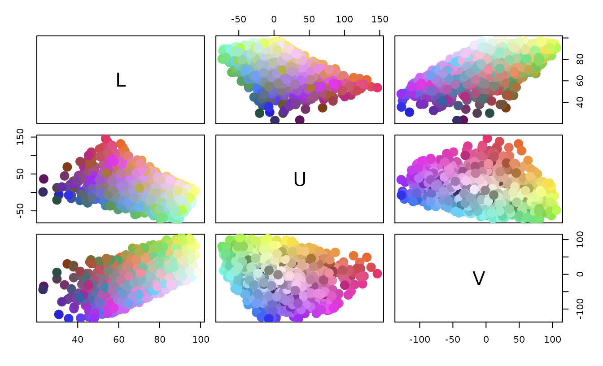
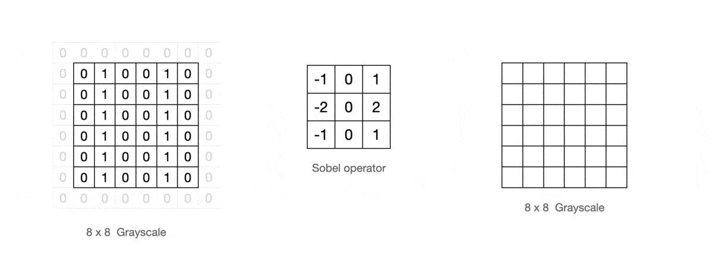

## Advanced Lane Finding

#### The project goal is to build a software pipeline by computer vision to identify the lane boundaries in a video from a front-facing camera on a car.

---

The goals / steps of this project are the following:

* Compute the camera calibration matrix and distortion coefficients given a set of chessboard images.
* Apply a distortion correction to raw images.
* Use color transforms, gradients, etc., to create a thresholded binary image.
* Apply a perspective transform to rectify binary image ("birds-eye view").
* Detect lane pixels and fit to find the lane boundary.
* Determine the curvature of the lane and vehicle position with respect to center.
* Warp the detected lane boundaries back onto the original image.
* Output visual display of the lane boundaries and numerical estimation of lane curvature and vehicle position.

[//]: # (Image References)
[image0]: ./src/calibration_matrix.png
[image1]: ./output_result/undistort_output.png "Undistorted"
[image2]: ./output_result/undistorted_output_1.png  "Road Transformed"
[image3]: ./output_result/color_select.png "Color Select"
[image4]: ./output_result/sobel_x_gradient.png "sobel of the Gradient"
[image5]: ./output_result/mag_gradient.png "Magnitude of the Gradient"
[image6]: ./output_result/binary_combo_example.jpg "Binary Example"
[image7]: ./output_result/perspective_transform.jpg "Warp Example"
[image8]: ./examples/color_fit_lines.jpg "Fit Visual"
[image9]: ./output_result/slide_windows.png "Slide Windows"
[image10]: ./output_result/search_prior.png "Search Prior"
[image11]: ./src/radius_of_curvature.png "Radius Curvature"
[image12]: ./output_result/plotted_back.png "Plotted Back"

[image10]: ./src/workflow.jpg "workflow"
[video1]: ./project_video.mp4 "Video"

#### [Rubric](https://review.udacity.com/#!/rubrics/571/view) Points

---

### Camera Calibration

#### 1. Briefly state how you computed the camera matrix and distortion coefficients. Provide an example of a distortion corrected calibration image.
The camera reflectred off of a 3D traffic sign and forms a 2D image at a sensor. In math this transformation from 3D object points P(X, Y, Z) to 2D image points P(x, y) is done by a transformative matrix called the camera matrix Cp that's needed to calibrate the camera. How to calibration the camera? we can take pictures of known shapes , then We'll be able to detect and correct any distortion errors. Using a chessboard image . A chessboard is great for calibration because it's regular high contrast pattern makes it easy to detect automatically and we know what an undistorted flat chessboard looks like. So we can use the camera to take multiple pictures of a chessboard against a flat surface.Then we'll be able to detect any distortion by looking at the difference between the apparent size and the shape of the squares in these images and the size and shape that they actually are.
```
 # Convert the image to grayscale 
 gray = cv2.cvtColor(img,cv2.COLOR_BGR2GRAY)
```
```
 # Find the chessboard corners
 ret, corners = cv2.findChessboardCorners(gray, (9,6),None)
```


Light rays often bend a little too much or too little at the edges of a curved lens of a camera.So there are 2 Distortion types:
- Radial Distortion
- Tangential Distortion

The distortion can generally be captured by Distortion coefficients = (k1, k2, p1, p2, k3), Those values reflect the amount of radial and tangential distortion in an image. So these coefficients can calibrate the camera and undistort the images. 
![mtx, dist][image0]

I start by preparing "object points", which will be the (x, y, z) coordinates of the chessboard corners in the world. Here I am assuming the chessboard is fixed on the (x, y) plane at z=0, such that the object points are the same for each calibration image.  Thus, `objp` is just a replicated array of coordinates, and `objpoints` will be appended with a copy of it every time I successfully detect all chessboard corners in a test image.  `imgpoints` will be appended with the (x, y) pixel position of each of the corners in the image plane with each successful chessboard detection.  
 ```
 # Add object and points image points to array
 objpoints.append(objp)
 imgpoints.append(corners)
```

I then used the output `objpoints` and `imgpoints` to compute the camera calibration and distortion coefficients using the `cv2.calibrateCamera()` function.  I applied this distortion correction to the test image using the `cv2.undistort()` function and obtained this result: 
```
# Given object points and image points, get calibration matrix and distortion coefficients
ret, mtx, dist, rvecs, tvecs = cv2.calibrateCamera(objpoints, imgpoints, img_size, None, None)

# Correcting for distortion
undst_img = cv2.undistort(img, mtx, dist, None, mtx)
```

![alt text][image1]

### Pipeline (single images)

#### 1. Distortion-corrected image.

```
undistorted_img = cal_undistort(distort_img_, objpoints, imgpoints)
```

![alt text][image2]

#### 2. Color threshold

A color space is a specific organization of colors, color spaces provide a way to categorize colors and represent them in digital images. RGB is red-green-blue color space. 
 
 
 
 However RGB Thresholding doesn't work that well in images that include varying light conditions like the lane under extreme brightness or when lanes are a different color like yellow. These are some of the most commonly used color spaces in image analysis. HLS Color Space, This isolates the lightness or L component of each pixel in an image. And this is the component that varies the most under different lighting conditions.But the H and S channels stay fairly consistent under shadow or excessive brightness. So discard the information in the L channel, we should be able to detect different colors of lane lines more reliable than in RGB color space. 
 
 
 
H has a range from 0 to 179 for degrees around the cylindrical color space

https://docs.opencv.org/master/de/d25/imgproc_color_conversions.html

I cvt image from BGR to HLS color space 
```
 hls = cv2.cvtColor(img, cv2.COLOR_BGR2HLS)
```
then select pixels by threshold





I used a combination of the other two color Spaces to better extract the colors I needed
```
    s_channel = cv2.cvtColor(img, cv2.COLOR_BGR2HLS)[:,:,2]
    l_channel = cv2.cvtColor(img, cv2.COLOR_BGR2LUV)[:,:,0]
    b_channel = cv2.cvtColor(img, cv2.COLOR_BGR2Lab)[:,:,2]  
```
![Color Select][image3]


#### 3. Gradient threshold

Sobel operator is a way fo taking the derivative of the image in the x or y direction. 

 

Taking the gradient in the x direction emphasizes edges closer to vertical, the y direction emphasizes edges closer to horizontal.

```
cv2.Sobel(gray, cv2.CV_64F, 1, 0, ksize=sobel_kernel)
```
I applied sobel as orientation **x**

![Sobel x][image4]

```
    # Calculate the x and y gradients
    sobelx = cv2.Sobel(gray, cv2.CV_64F, 1, 0, ksize=sobel_kernel)
    sobely = cv2.Sobel(gray, cv2.CV_64F, 0, 1, ksize=sobel_kernel)
    
    # Calculate the gradient magnitude
    gradmag = np.sqrt(sobelx**2 + sobely**2)
```
![Magnitude Gradient][image5]

then I combined color transforms, gradients thresholds all to get a thresholed image
![Combined Image][image6]


#### 4. Perspective Transform
Lane curvature is very important piece of information, Self-driving cars need to be told the correct steering angle to turn left or right and I can calculate this angle when knowing a few things about the speed and dynamics of the car and how much the lane is curving.First I'll detect the lane lines using some masking and thresholding techniques.Then, perform a perspective transform to get a birds eye view of the lane .Four points are enough to define a linear transformation from one perspective to another.

First, I calculated the perspective matrix. then saved the perspective transform **M** matrix and the inverse perspective transform **Minv** matrix
```

    # source coordinates
    src = np.float32([[575, 465],[705,465],
                      [255,685],[1050,685]])

    # desired coordinates
    dst = np.float32([[offset, 0],[width-offset,0],
                      [offset, height],[width-offset,height]]) 
    
    # compute the perspective transform M given source and destination points
    M = cv2.getPerspectiveTransform(src, dst)
    # Compute the inverse perspective transform
    Minv = cv2.getPerspectiveTransform(dst, src)

```

```

    # undistort using mtx and dist
    undist = cv2.undistort(img, mtx, dist, None, mtx)

    # Warp an image using the perspective transform
    warped = cv2.warpPerspective(undist, M, img_size, flags=cv2.INTER_LINEAR)

```
![Perspective transform][image7]


#### 4. Identified lane-line pixels and fit their positions with a polynomial
I found peaks in a histogram to identify leftx_base and rightx_base. 
```
    histogram = np.sum(binary_warped[binary_warped.shape[0]//2:,:], axis=0)
```
I identified the x and y positions of all nonzero pixels in the image
```
    # Identify the x and y positions of all nonzero pixels in the image
    nonzero = binary_warped.nonzero()
    nonzeroy = np.array(nonzero[0])
    nonzerox = np.array(nonzero[1])
```
- Sliding windows method
then I implemented sliding windows to scan all pixels in the windows
```
    # Identify the nonzero pixels in x and y within the window #
    good_left_inds = ((nonzeroy >= win_y_low) & (nonzeroy < win_y_high) & 
    (nonzerox >= win_xleft_low) &  (nonzerox < win_xleft_high)).nonzero()[0]
    good_right_inds = ((nonzeroy >= win_y_low) & (nonzeroy < win_y_high) & 
    (nonzerox >= win_xright_low) &  (nonzerox < win_xright_high)).nonzero()[0]
```
Then I got all line *pixles leftx, lefty, right x righty*. so I applied a *np.polyfit* to get A and B coefficient。
![Curve coefficients ][image8]
I'd used the A and B got a smooth curve.

```
    # Generate x and y values for plotting
    ploty = np.linspace(0, binary_warped.shape[0]-1, binary_warped.shape[0] )

    left_fitx = left_fit[0]*ploty**2 + left_fit[1]*ploty + left_fit[2]
    right_fitx = right_fit[0]*ploty**2 + right_fit[1]*ploty + right_fit[2]
    
```
![Slide windows][image9]

- Search line from Prior area

First, I need to feed A and B coefficients of the curve in the previous frame. So get new *left_lane_inds* and *right_lane_inds* between margin index pixels.
```
    ### within the +/- margin of our polynomial function ###
    left_lane_inds = ((nonzerox > (left_fit[0]*(nonzeroy**2) + left_fit[1]*nonzeroy + 
                    left_fit[2] - margin)) & (nonzerox < (left_fit[0]*(nonzeroy**2) + 
                    left_fit[1]*nonzeroy + left_fit[2] + margin)))
    right_lane_inds = ((nonzerox > (right_fit[0]*(nonzeroy**2) + right_fit[1]*nonzeroy + 
                    right_fit[2] - margin)) & (nonzerox < (right_fit[0]*(nonzeroy**2) + 
                    right_fit[1]*nonzeroy + right_fit[2] + margin)))
    
    # Again, extract left and right line pixel positions
    leftx = nonzerox[left_lane_inds]
    lefty = nonzeroy[left_lane_inds] 
    rightx = nonzerox[right_lane_inds]
    righty = nonzeroy[right_lane_inds]
```
Here, I feed previous frame fit pixels to calculate the previous curve.
```
    self.pre_left_fitx = None
    self.pre_right_fitx = None
    self.pre_ploty = None
```
then apply 'np.polyfit' to get the new A and B coefficient. so got new curve fit pixels.
```
def fit_poly(img_shape, leftx, lefty, rightx, righty):
    left_fit = np.polyfit(lefty, leftx, 2)
    right_fit = np.polyfit(righty, rightx, 2)
    # Generate x and y values for plotting
    ploty = np.linspace(0, img_shape[0]-1, img_shape[0])
    
    # while normally calculate a y-value  for a given x, here we do the opposite, 
    # why? because we expect our lane lines to be mostly vertically-oriented.
    left_fitx = left_fit[0]*ploty**2 + left_fit[1]*ploty + left_fit[2]
    right_fitx = right_fit[0]*ploty**2 + right_fit[1]*ploty + right_fit[2]
    
    return left_fitx, right_fitx, ploty
```
![Search prior][image10]

#### 5. Calculated the radius of curvature of the lane and the position of the vehicle with respect to center
![alt text][image11]
Calculated the radius of curvature as a formula
```
# Compute curvature radius
left_curv_radius = ((1 + (2*left_fit_converted[0]*yvalue + left_fit_converted[1])**2)**1.5) / (2*np.absolute(left_fit_converted[0]))
right_curv_radius = ((1 + (2*right_fit_converted[0]*yvalue + right_fit_converted[1])**2)**1.5) / (2*np.absolute(right_fit_converted[0]))
```
Compute distance in meters of vehicle center from the line.
```    
# Compute distance in meters of vehicle center from the line
car_center = img.shape[1]/2  # we assume the camera is centered in the car
lane_center = (left_fitx[-1] + right_fitx[-1]) / 2
center_dist = (lane_center - car_center)* xm_per_pix
```

#### 6. an example image of result plotted back down onto the road.

I implemented this step in lines # through # in my code in main.py in the function draw_detected_lane(self, left_fitx, right_fitx, plot). Here is an example of my result on a test image:

![Plotted back][image12]

---

### Pipeline (video)

#### 1. Provide a link to your final video output.  Your pipeline should perform reasonably well on the entire project video (wobbly lines are ok but no catastrophic failures that would cause the car to drive off the road!).

Here's a [link to my video result](./output_result/video_output.mp4)

---

### Discussion

#### 1. Briefly discuss any problems / issues you faced in your implementation of this project.  Where will your pipeline likely fail?  What could you do to make it more robust?

If one lane line is blurred and the other is clear or the lane line on the side is clear, the algorithm is easy to lose lane lines. There is also a case where if the road turns continuously, the algorithm will not be able to find the lane lines. I couldn't hard coding to resolve all situations. Perhaps there are more advanced and robust technical solutions.
